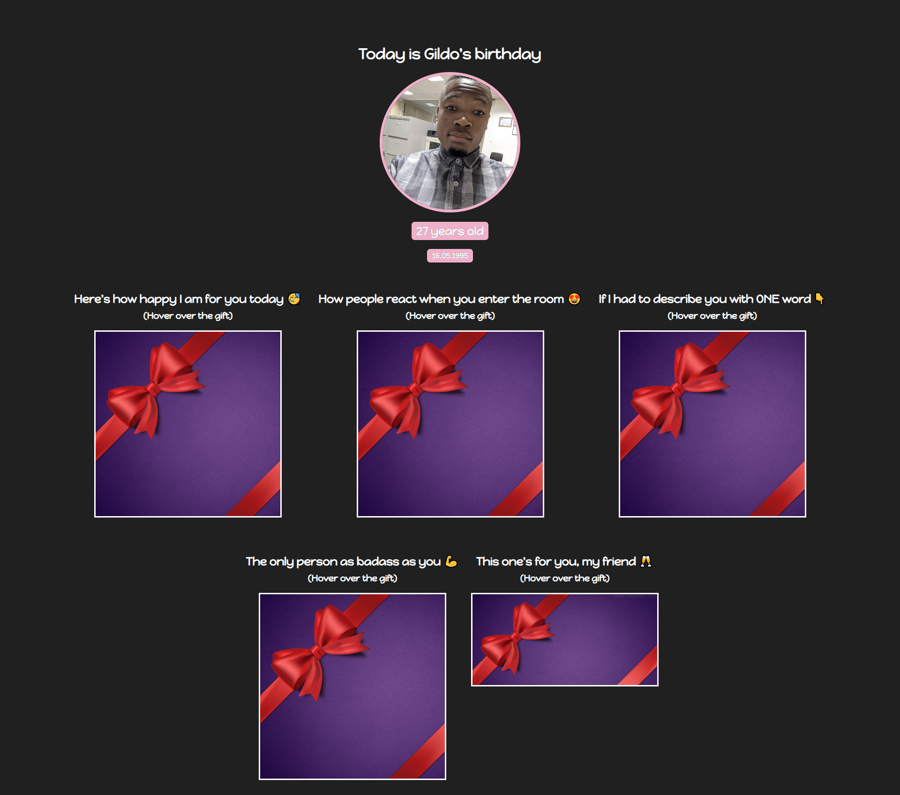

# Birthday Gift Site

## Introduction:

This document outlines the design and implementation of a static birthday gift website. The site is built using HTML, CSS, and doesn't rely on any dynamic functionality, such as a database or server-side scripting.

## Design:

The website is designed to be simple and user-friendly, with a clean layout. The home page is the unique page of the site and contain Box's with gifts that you can hover to reveal the content.

## Implementation:

The website is implemented using HTML, CSS. The website uses HTML to define the structure and content of the pages, CSS to control the layout and styling of the pages.

## Conclusion:

The Static Birthday Gift Site is a simple and user-friendly website built using HTML, CSS, and doesn't rely on any dynamic functionality. The website is designed to be simple and user-friendly, with a clean a layout, and has been thoroughly tested for compatibility and usability.

---

<h1 align="center">
Designed with ❤️ by
 
 Gildo Costa Chauze
</h1>

   <h3>📫 Reach me 👇</h3>
  
  
     

